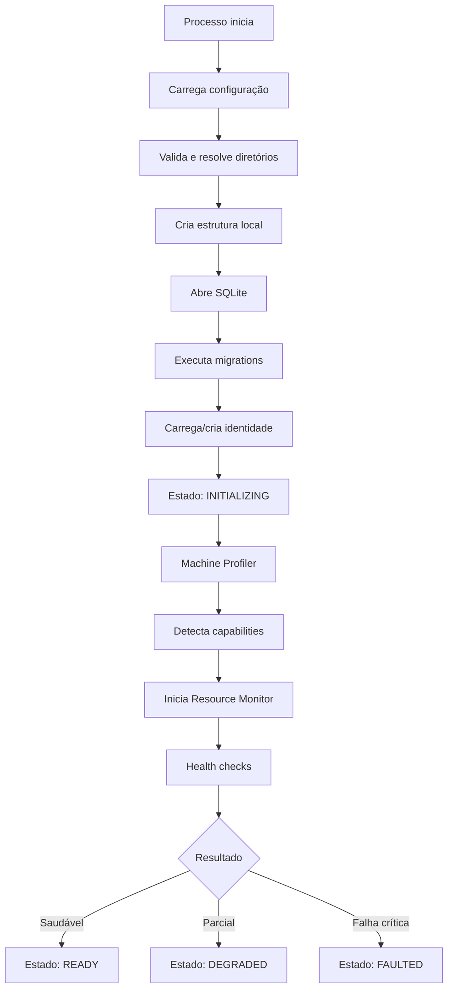
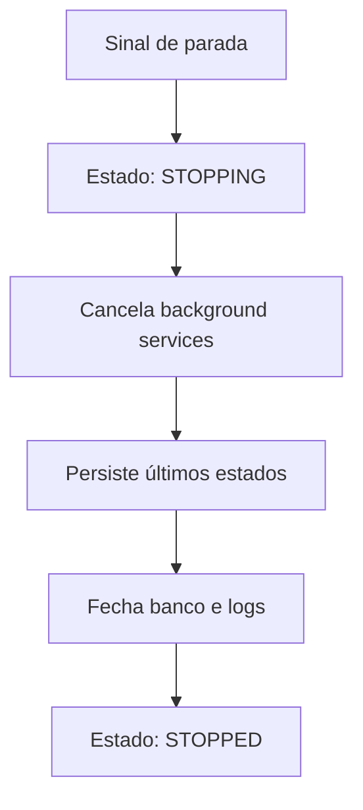
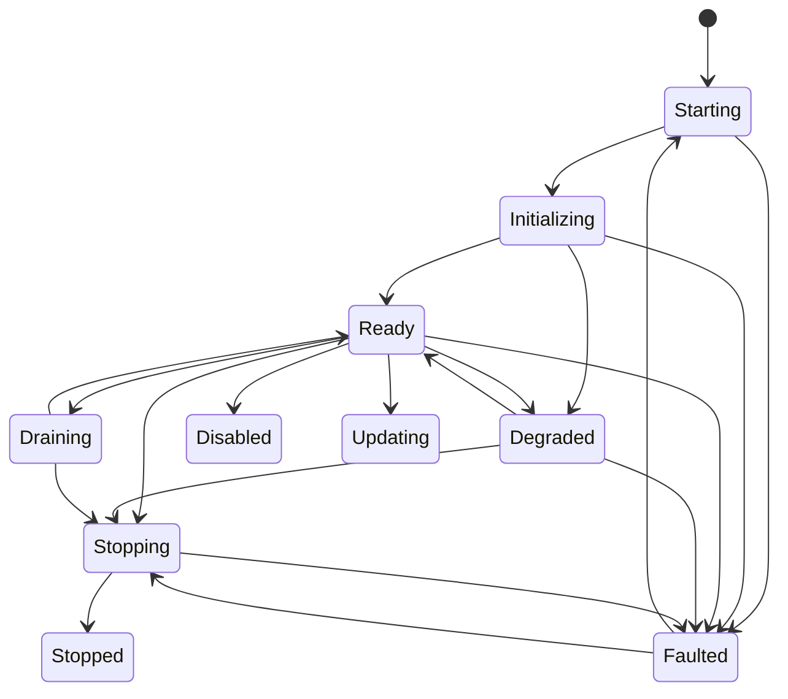

# Ciclo de Vida do Agent

## Inicialização

```mermaid
flowchart TD
    A[Processo inicia] --> B[Carrega configuração]
    B --> C[Valida e resolve diretórios]
    C --> D[Cria estrutura local]
    D --> E[Abre SQLite]
    E --> F[Executa migrations]
    F --> G[Carrega/cria identidade]
    G --> H[Estado: INITIALIZING]
    H --> I[Machine Profiler]
    I --> J[Detecta capabilities]
    J --> K[Inicia Resource Monitor]
    K --> L[Health checks]
    L --> M{Resultado}
    M -->|Saudável| N[Estado: READY]
    M -->|Parcial| O[Estado: DEGRADED]
    M -->|Falha crítica| P[Estado: FAULTED]
```

## Encerramento

```mermaid
flowchart TD
    A[Sinal de parada] --> B[Estado: STOPPING]
    B --> C[Cancela background services]
    C --> D[Persiste últimos estados]
    D --> E[Fecha banco e logs]
    E --> F[Estado: STOPPED]
```

## Estados do Agent

```mermaid
stateDiagram-v2
    [*] --> Starting
    Starting --> Initializing
    Starting --> Faulted
    Initializing --> Ready
    Initializing --> Degraded
    Initializing --> Faulted
    Ready --> Degraded
    Ready --> Draining
    Ready --> Disabled
    Ready --> Updating
    Ready --> Stopping
    Ready --> Faulted
    Degraded --> Ready
    Degraded --> Stopping
    Degraded --> Faulted
    Draining --> Ready
    Draining --> Stopping
    Stopping --> Stopped
    Stopping --> Faulted
    Faulted --> Starting
    Faulted --> Stopping
```
